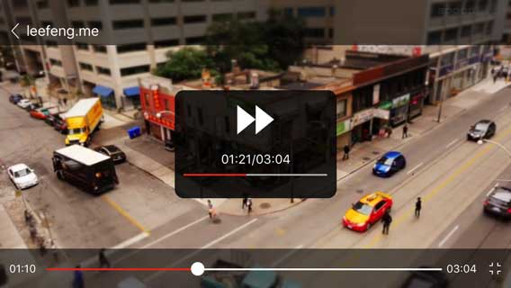
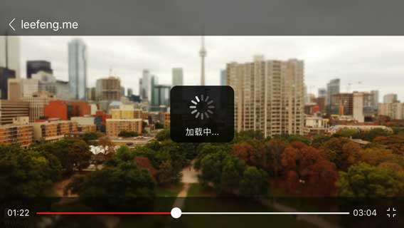
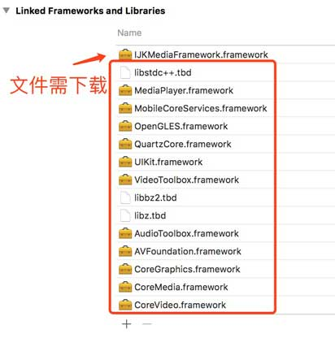

# Swift-IJKPlayer

IJKPlayer的封装视频播放器封装，Swift编写。仿今日头条视频播放器。



### How To Use

1、添加依赖库


需要下载的framework：

真机（一般用于上线）：链接:http://pan.baidu.com/s/1dF2Bx3j  密码:t56g

模拟器+真机（一般用于测试）：链接:http://pan.baidu.com/s/1gf5VjUz  密码:w8fh

2、把项目中 VideoPlayer 文件夹拖进自己的项目

3、有一个桥接文件，如果自己已经配置了则添加：#import "Slider.h" ，没有则使用VideoPlayer文件夹中的 Swift-IJKPlayer-Bridging-Header.h 文件作为桥接文件。

4、基本设置

```
//以下必须配置
//得到控制器
playerController = PlayerViewController()
if let playerView = playerController?.view {
//初始化播放界面的大小
playerController?.frame = CGRect(x: 0, y: 0, width: UIScreen.main.bounds.width,height: height)
//添加控制器
addChildViewController(playerController!)
//添加播放界面
view.addSubview(playerView)

}
//设置路径后立即播放,默认true
playerController?.isAutoPlay = false
//设置路径
playerController?.url = "http://baobab.wandoujia.com/api/v1/playUrl?vid=2616&editionType=normal"
//以下选配
//设置封面
playerController?.coverImageView()?.image = UIImage(named: "cover")
playerController?.playerTitle = "leefeng.me"
//协议
playerController?.playerProtocol = self

```

5、协议方法


````
internal func playerStartComplete() {
    print("playerStartComplete 播放完成")
}

internal func playerStartPause() {
    print("playerStartPause 播放暂停")
}

internal func playerStartPlay() {
    print("playerStartPlay 开始播放")
}

````

6、其他API

play()播放

pause() 暂停

shutDown()退出

基库： https://github.com/Bilibili/ijkplayer

# License

```
Copyright  2017 Limxing

Licensed under the Apache License, Version 2.0 (the "License");
you may not use this file except in compliance with the License.
You may obtain a copy of the License at

http://www.apache.org/licenses/LICENSE-2.0

Unless required by applicable law or agreed to in writing, software
distributed under the License is distributed on an "AS IS" BASIS,
WITHOUT WARRANTIES OR CONDITIONS OF ANY KIND, either express or implied.
See the License for the specific language governing permissions and
limitations under the License.

```
